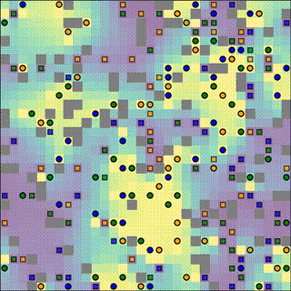

# Group-Action MAPF

> Multi-Agent Path Finding workspace for CMU 16-891 Multi-Robot Planning and Coordination final course project.


---

## Overview

This repository is a **MAPF workspace for the `Group Theory MAPF` project** developed for CMU 16-891. It combines:

- baseline planners such as CBS, PBS, Prioritized, and Joint-State
- group-action style planners
- a TAPF variant guided by Poisson potential fields
- randomized benchmark generation from MovingAI `.map` files

The main runner script is `src/run_experiments.py`, which loads instance files, executes a selected solver, and records results.

---

## Demo Video

A sample project demo is shown below:

[](Documents/thumbnail.gif)


---

## Features

- Multiple MAPF solvers
- Group action MAPF solver
- Group action TAPF solver with Poisson potential guidance
- Benchmark generation utility from `.map` to instance format

---

## Core Components

| Component | File | Purpose |
|---|---|---|
| Experiment runner | `src/run_experiments.py` | Loads instances, chooses solver, runs planning, logs CSV results |
| Group-action solver | `src/group_action.py` | Tree-based group-action MAPF solver |
| TAPF solver | `src/group_action_tapf.py` | Group-action TAPF planner with Poisson field guidance and backtracking |
| Poisson field solver | `src/poisson_solver.py` | Builds and solves a sparse Poisson system over free cells |
| Benchmark converter | `src/map_loader.py` | Converts MovingAI `.map` files into project instance text files |
| Visualizer | `src/visualize.py` | Animates MAPF solutions for non-batch runs |
| Plot utilities | `src/plotter.py` | Optional field/path plotting helpers |

---

## Repository Structure

```text
Group-Action-MAPF/
├── mapf-map/                   # MovingAI map files (.map)
├── src/
│   ├── benchmarks/             # Generated instances from map_loader.py
│   ├── instances/              # Generated instances from CMU 16-891
│   ├── results/                # Collected CSV outputs
│   ├── run_experiments.py
│   ├── map_loader.py
│   ├── group_action_tapf.py
│   ├── poisson_solver.py
│   ├── cbs.py
│   ├── pbs.py
│   ├── prioritized.py
│   ├── independent.py
│   ├── joint_state.py
│   └── ...
├── Documents/
└── README.md
```

---

## Requirements

- Python 3.x
- `numpy`
- `scipy`
- `matplotlib`
- `treelib`

Install dependencies:

```bash
pip install numpy scipy matplotlib treelib
```

---

## Instance Format

Instance files (used by `run_experiments.py`) follow:

1. `rows cols`
2. `rows` lines of map grid (`.` free, `@` blocked)
3. `num_agents`
4. `num_agents` lines: `sx sy gx gy`

---

## Quick Start

From the project root:

```bash
cd src
python run_experiments.py --instance "instances/test_1.txt" --solver GroupActionTAPF
```

Run batch experiments:

```bash
python run_experiments.py --instance "instances/test_*" --solver GroupActionTAPF --batch
```

---

## Solvers

Use `--solver` with one of:

- `CBS`
- `PBS`
- `Independent`
- `JointState`
- `Prioritized`
- `GroupAction`
- `GroupActionGreedy`
- `GroupActionIndependent`
- `GroupActionTAPF`

Example:

```bash
python run_experiments.py --instance "instances/test_*" --solver CBS --batch
```

---

## Benchmark Generation from `.map`

Use `map_loader.py` to generate random-agent instances from MovingAI maps.

Example:

```bash
cd src
python map_loader.py mapf-map/random-32-32-10.map 10
```

This writes to:

```text
src/benchmarks/{map_name}/agents_{num_agents}
```

Example produced file:

```text
src/benchmarks/random-32-32-10/agents_10
```

Run on generated benchmark:

```bash
python run_experiments.py --instance "benchmarks/random-32-32-10/agents_10" --solver GroupActionTAPF
```

Batch over multiple generated agent counts:

```bash
python run_experiments.py --instance "benchmarks/random-32-32-10/agents_*" --solver GroupActionTAPF --batch
```

---

## Results Output

`run_experiments.py` writes CSV rows to `src/results.csv` with:

```text
instance_path,solution_cost,cpu_time_sec,node_count
```

- `solution_cost`: sum of path costs
- `cpu_time_sec`: wall-clock runtime for `find_solution()`
- `node_count`: tree node count for tree-based solvers (0 for others)

---

## Useful Commands

A few commonly used commands in this workspace:

```bash
python run_experiments.py --instance "instances/test_*" --solver GroupActionGreedy --batch
python run_experiments.py --instance "instances/test_1.txt" --solver GroupActionTAPF --graph
python map_loader.py mapf-map/maze-32-32-2.map 10
python run_experiments.py --instance "benchmarks/maze-32-32-2/agents_*" --solver GroupActionTAPF --batch
```

---

## Author

- **Boxiang Fu** (`boxiangf@cs.cmu.edu`)

---

## License

```text
Apache License 2.0
```

---

## Acknowledgments

- CMU 16-891 course staff
- MAPF and planning research community
- MovingAI benchmark map maintainers
